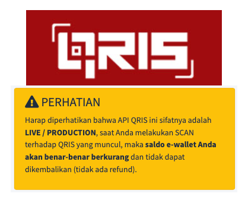

# QRIS Simulator



Simulator untuk melakukan _premeditative double check_ untuk
aplikasi yang akan di integrasikan ke QRIS Payment Gateway,
serta untuk mengurangi biaya dan waktu development.

**Kata Kata yang diambil dari website official QRIS :**

>> PERHATIAN
>>
>> Harap diperhatikan bahwa API QRIS ini sifatnya adalah LIVE / PRODUCTION, saat Anda melakukan SCAN terhadap QRIS yang muncul, maka saldo e-wallet Anda akan benar-benar berkurang dan tidak dapat dikembalikan (tidak ada refund).

**Sungguh menyedihkan T_T**

Official QRIS tidak memberikan developer simulator yang dapat dicoba
tanpa mengurangi saldo, dengan itu project ini dibuat sebagai
simulator penyedia QRIS yang dapat anda gunakan untuk mencoba
integrasi program anda.

Simulator ini dibuat 95% menyerupai
behaviour QRIS itu sendiri, jika program anda lancar ketika menggunakan
simulator ini, maka anda hanya perlu mengganti beberapa variable untuk
melanjutkan aplikasi anda ke tahap produksi.

## Fitur

### 0. Auto Initialization Questionaire

QRIS Simulator memperlukan beberapa data -- yang sebisa mungkin anda mockup -- untuk mensimulasikan proses pembayaran dengan akurat, seperti:

0. `APIKEY`
1. `mID`

juga beberapa variable pendukung seperti

0. Server Listening `PORT`
1. Server Listening `HOSTNAME`

QRIS Simulator sudah dilengkapi pertanyaan yang perlu anda jawab 1x ketika pertamakali menggunakan. atau anda dapat membuat file bernama `user_config.json` dan mengisi / merubah sendiri ketika sudah dibuat untuk menghindari questionaire.

### 1. Create Invoice

anda dapat dengan cara normal yang diberikan oleh dokumentasi Official QRIS untuk membuat invoice

### 2. Cek Status Pembayaran

cek status pembayaran dapat dilakukan sebagai mana dokumentasi QRIS.

### 3. Mekanisme Ban untuk API Key

Sesuai dengan ketentuan penggunaan API Key untuk API Call, API Key dapat terkena ban jika digunakan terlalu banyak.

## Instalasi

0. Lakukan clone repo ini
    ```
    git clone https://github.com/wowotek/qris_simulator.git
    ```
1. instalasi dependensi yang dibutuhkan
    ```
    npm install
    ```
2. jalankan server
    ```
    npm start
    ```

## Kustomisasi

0. Lakukan step 0 hingga 1 pada tahap instalasi
1. ubah hal yang perlu anda ubah
2. jalankan server menggunakan `ts-node-dev`
    ```
    npm run start-dev
    ```

## Penggunaan

Setelah melewati tahap membuat atau menjalani questioner
setup server make selanjutnya `Host URL` akan disingkat menjadi `[HOST]` maka jika `Host Url` anda adalah
`localhost:3333` maka `[HOST]/indeks` artinya adalah
`http://localhost:3333/indeks`.

Anda bisa menggunakan tata cara dibawah, atau mengikuti tahap
yang terdokumentasikan secara Official oleh [Website QRIS](https://qris.id/api-doc/index.php).

Untuk mockup pembayaran silahkan lakukan **tahap nomor 2**


0. Buat Invoice (Creat Invoice) dengan hit ke
    - URI: `[HOST]/restapi/qris/show_qris.php`
    - METHOD: `GET`
    - Query Parameter
        - `do`
            - berisi `create-invoice` (**WAJIB**)
        - `apikey`
            - berisi `API KEY` yang anda masukan pada tahap
            questioner, atau yang ada didalam `user_config.json`
        - `mID`
            - berisi `mID` yang anda masukan pada tahap
            questioner, atau yang ada didalam `user_config.json`
        - `cliTrxNumber`
            - adalah nomor invoice yang secara unik anda generate
            - Nomor ini harus unik setiap kali
        - `cliTrxAmount`
            - Jumlah yang perlu dibayar oleh customer
1. QRCode mockup akan tergenerate di Console / Terminal,
atau bisa juga anda lakukan generate QRCode sesuai dengan
response yang diterima setelah hit tahap 0
2. Scan QR Code yang digenerate
3. Masukan Nama Customer (Opsional) dan masukan mockup metode pembayaran (Wajib)
4. Lakukan hit Cek Pembayaran (Check Invoice Status)
    - URI `[HOST]/restapi/qris/checkpaid_qris.php`
    - METHOD: `GET`
    - Query Parameter
        - `do`
            - Wajib berisi `checkStatus`
        - `apikey`
            - berisi `API KEY` yang anda masukan pada tahap
            questioner, atau yang ada didalam `user_config.json`
        - `mID`
            - berisi `mID` yang anda masukan pada tahap
            questioner, atau yang ada didalam `user_config.json`
        - `invid`
            - berisi `invoice id` yang digenerate pada tahap 0
        - `trxvalue`
            - berisi jumlah yang ditagihkan ke customer
        - `trxdate `
            - tanggal transaksi yang didapatkan pada tahap 0 dengan format `YYYY-mm-dd`
5. Selesai

## Kontribusi

sangat dibutuhkan kontribusi untuk projek ini untuk memastikan developer yang akan
menggunakan QRIS sebagai payment gateway dapat melakukan _premeditative double check_
untuk integrasi software yang sedang dalam tahap development untuk menghidari
penggunaan uang serta status **BAN** untuk API_KEY yang terlalu banyak digunakan.

berikut beberapa hal yang terfikir yang dapat dijadikan
subjek kontribusi

0. Penulisan dan Design README ini yang lebih baik
1. Lokalisasi untuk developer yang tidak berbahasa Indonesia / Inggris
2. Design Front-end untuk page :
    - Invalid Address
    - Payment Status Success dan Failed
    - Mockup Payment Invalid Token
3. Design Front-End untuk Payment Mocker yang mirip seperti:
    - GoPAY
    - ShopeePay
    - LivinByMandiri
    - Blu
    - DANA
    - LinkAja
    - OVO
    - ...dan metode pembayaran lain yang disupport QRIS
4. Sistem multiple mID dan API Key untuk support beberapa aplikasi sekaligus
5. Fitur Banning yang lebih akurat dan menyerupai QRIS
6. API Response yang lebih akurat dan menyerupai QRIS
7. QRCODE generation yang lebih akurat dan menyerupai QRIS
8. Penulisan Dokumentasi penggunaan projek ini yang lebih baik
9. Penulisan Dokumentasi Kode Projek ini yang lebih baik